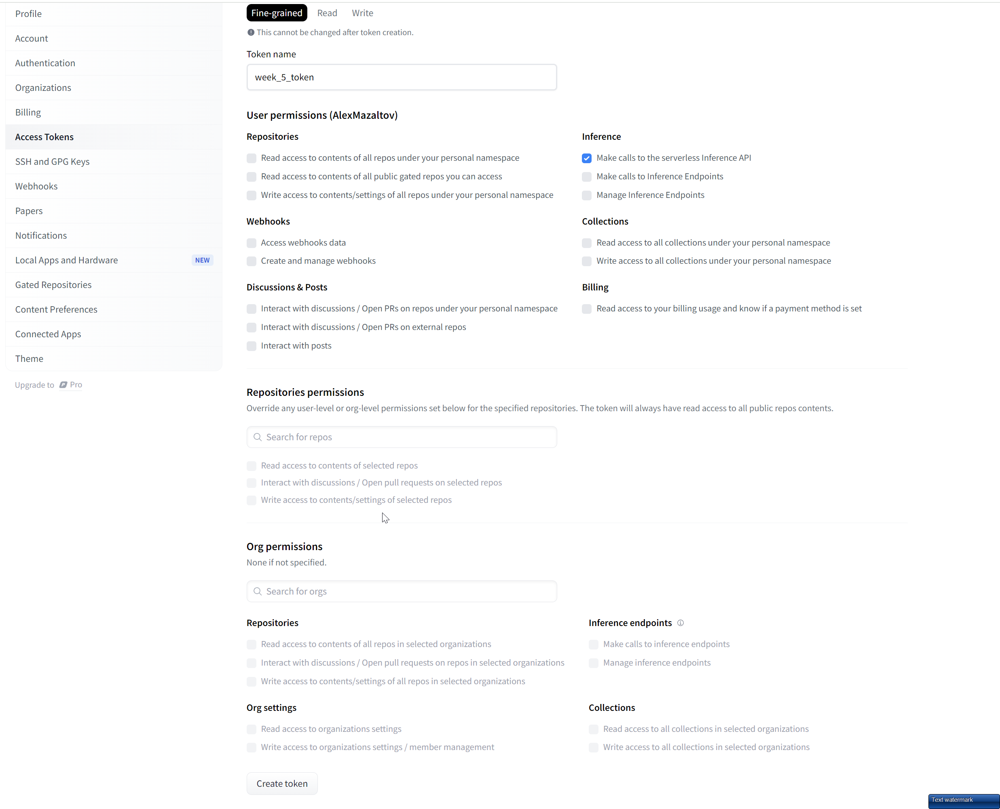

## Initialisation

```bash
npm install
```

## Create .env.local file
Generate a HuggingFace API key [here](https://huggingface.co/settings/tokens) and add the following line to the `.env.local` file in the root of the project:


Create a file named `.env.local` in the `src` folder of the project and add the following line:

```bash
HUGGINGFACE_API_KEY=<YOUR_HUGGINGFACE_API_KEY>
```

## Run the development server

```bash
npm run dev
```

Open [http://localhost:3000](http://localhost:3000) with your browser to see the result.